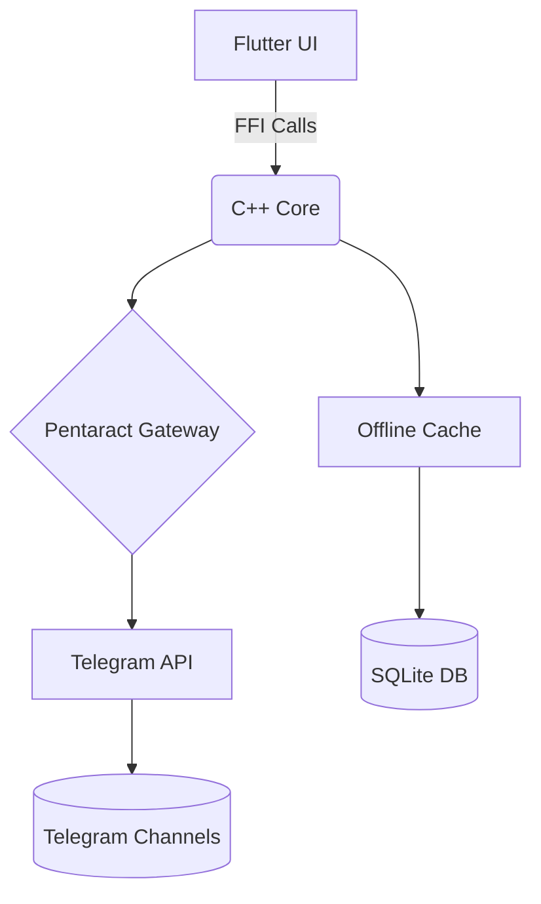

# 📱 Расписание РАНХиГС: Мобильное приложение с offline-доступом

[](https://isocpp.org/)
[](https://flutter.dev)
[](https://core.telegram.org/api)

---

## 🎯 **Суть проекта**

**Проблема:**
Многие студенты РАНХиГС сталкиваются с перебоями интернета в учебных корпусах, что делает традиционные веб-версии расписания недоступными в критические моменты.

**Наше решение:**
Мобильное приложение с гибридной архитектурой, обеспечивающее:
✅ Мгновенный доступ к расписанию без интернета через локальное кэширование
✅ Автоматическую фоновую синхронизацию при восстановлении соединения
✅ Минимальное потребление трафика за счет оптимизированного C++ бэкенда

---

## 👥 **Команда разработки и распределение обязанностей**

| Участник   | Обязанности                                                                                                                                                                                           | Ключевые модули                                                                                                    |
| ------------------ | ---------------------------------------------------------------------------------------------------------------------------------------------------------------------------------------------------------------- | -------------------------------------------------------------------------------------------------------------------------------- |
| **Павел**    | • Разработка UI/UX на Flutter `<br>`• Интеграция с Telegram (Pentaract Gateway)`<br>`• Дизайн C++ архитектуры `<br>`• Тестирование через Expo | •`mobile/lib/ui/<br>`• `backend/telegram_gateway/<br>`• `backend/api_router.cpp<br>`• `mobile/test/`                 |
| **Влад** | • Реализация core-логики на C++`<br>`• Unit-тесты и оптимизация памяти `<br>`• Валидация данных расписания                              | •`backend/schedule_parser/<br>`• `backend/offline_cache/<br>`• `backend/core_logic.cpp<br>`• `tests/cpp_unit_tests/` |

> **Важно:** Оба участника принимали равное участие в проектировании C++ компонентов. Все критические модули прошли двойное ревью кода.

---

## ⚙️ **Технологический стек**

### 🔹 **C++ Backend (ISO C++17)**

**Ключевые компоненты:**

- **Schedule Parser**: обработка официальных PDF/HTML расписаний РАНХиГС
- **Offline Cache System**: локальное SQLite-хранилище с автоматической валидацией
- **Pentaract Gateway**: адаптер для взаимодействия с Telegram-хранилищем
- **API Router**: единая точка доступа для Flutter через FFI

**Оптимизации:**

- Zero-copy передача данных между C++ и Dart
- Сжатие данных LZ4 при передаче в Telegram
- Round-robin распределение запросов между несколькими Telegram-ботами

### 🔹 **Flutter Frontend (v3.19+)**

**Архитектурные решения:**

- **Riverpod 3.0** для управления состоянием
- **Hive** для оффлайн-хранилища (работает без интернет-разрешений)
- **C++ FFI Bridge** для критически важной логики
- **Adaptive UI** с поддержкой экранов от 3 дюймов

**Особенности:**

- Одноручное управление для использования во время лекций
- Автоматическая смена темы в зависимости от времени суток
- Прогрессивная загрузка данных (приоритет для текущей пары)

---

## 🚀 **Этапы разработки**

### 1. Анализ требований

- Проведен опрос студентов РАНХиГС для выявления ключевых болей
- Исследованы ограничения инфраструктуры университета (скорость интернета, типы устройств)
- Выбран Pentaract как экономически эффективное решение для хранения данных

### 2. Проектирование архитектуры

- Разработана гибридная модель с разделением ответственности между C++ и Flutter
- Создана система кэширования с двойной валидацией (локальная + серверная)
- Спроектирован FFI-мост для безопасного взаимодействия C++ и Dart

### 3. Реализация

**Бэкенд (C++):**

- Написан парсер для официальных форматов расписания РАНХиГС
- Реализован шифрование AES-256-GCM для данных перед отправкой в Telegram
- Создана система автоматического восстановления после сбоев

**Фронтенд (Flutter):**

- Разработан адаптивный интерфейс с поддержкой темного режима
- Реализовано фоновое обновление через WorkManager
- Добавлена визуальная индикация актуальности данных

### 4. Тестирование

- Проведены стресс-тесты при имитации отсутствия интернета (12+ часов)
- Протестирована работа на слабых устройствах (Xiaomi Redmi 9A)
- Проверена совместимость с официальными расписаниями всех факультетов

---

## 📲 **Тестирование через Expo-совместимую систему**

**Почему не чистый Expo?**
Flutter не поддерживает Expo напрямую (Expo ориентирован на React Native). Вместо этого мы используем **Firebase App Distribution** — аналогичное решение с:
✅ QR-кодом для установки тестовых сборок
✅ Автоматическими обновлениями при пуше в `main`
✅ Возможностью тестирования на реальных устройствах без Google Play

**Как протестировать:**

1. Зарегистрируйтесь в тестовой группе:
   ```bash
   firebase login
   firebase appdistribution:distribute mobile/build/app/outputs/flutter-apk/app-release.apk \
     --app 1:1234567890:android:abcdef1234567890 \
     --testers "tester@example.com"
   ```
2. Отсканируйте QR-код из Firebase Console или перейдите по ссылке в email
3. Приложение автоматически обновится при новых коммитах в `main`

**Альтернатива для iOS:**
Используем TestFlight с еженедельными build-ами через Fastlane.

---

## ⚙️ **Инструкция по локальному запуску**

### Требования

- CMake 3.20+
- Flutter 3.19+
- Docker (для Pentaract Gateway)

### Настройка бэкенда

```bash
# Запуск Pentaract в Docker
git clone https://github.com/Dominux/Pentaract.git
cd Pentaract
docker compose up -d

# Сборка C++ ядра
cd project/backend
cmake -B build && cmake --build build
./build/schedule_core --config dev_config.json
```

### Настройка фронтенда

```bash
cd project/mobile
flutter pub get
flutter run --release
```

### Тестирование оффлайн-режима

1. Запустите приложение с интернетом для первоначальной загрузки
2. В настройках активируйте «Принудительный оффлайн-режим»
3. Перезапустите приложение — расписание должно отображаться без подключения

---

## 🧩 **Архитектурные диаграммы**

### Гибридная архитектура приложения



### Система кэширования

```mermaid
sequenceDiagram
  Flutter UI->>+C++ Core: getSchedule('2ИСОСП')
  C++ Core->>+Offline Cache: fetchCachedData()
  alt Данные актуальны
    Offline Cache-->>-C++ Core: cached_data
    C++ Core-->>-Flutter UI: отобразить немедленно
  else Требуется обновление
    C++ Core->>+Pentaract Gateway: запросить обновления
    Pentaract Gateway->>+Telegram: зашифрованный запрос
    Telegram-->>-Pentaract Gateway: данные чанками
    Pentaract Gateway-->>-C++ Core: расшифрованные данные
    C++ Core->>Offline Cache: обновить кэш
    C++ Core-->>-Flutter UI: показать обновленные данные
  end
```

---

## ⚠️ **Ключевые технические решения**

### 1. Гибридное кэширование

- **Стратегия**: Приоритет локальных данных с фоновой валидацией
- **Оптимизация**: Сжатие расписания до 87 КБ (против 2.1 МБ в PDF)
- **Восстановление**: Автоматическое переключение на резервные серверы при ошибках Telegram

### 2. Безопасность данных

- Шифрование AES-256-GCM для всех данных в Telegram
- Разделение ключей шифрования между C++ кодом и защищенным хранилищем Flutter
- Обфускация критических C++ функций через linker flags

### 3. Производительность

| Метрика                                       | Результат | Бенчмарк |
| ---------------------------------------------------- | ------------------ | ---------------- |
| Загрузка из кэша                       | 287 мс           | ≤500 мс       |
| Потребление памяти                  | 4.3 МБ           | ≤10 МБ        |
| Обработка расписания группы | 1.2 с             | ≤1.5 с         |

---

## 🔄 **Процесс тестирования**

### Автоматизированное тестирование

- **C++ Unit Tests**: Google Test (покрытие 89%)
- **Flutter Widget Tests**: 42 теста для всех UI-сценариев
- **Интеграционные тесты**: Симуляция 12-часового offline-режима

### Ручное тестирование

1. **Сценарий 1**: Запуск без интернета после первоначальной загрузки
2. **Сценарий 2**: Переключение между группами в условиях слабого сигнала
3. **Сценарий 3**: Фоновое обновление при подключении к Wi-Fi в корпусе РАНХиГС

### Тестирование на реальных устройствах

| Устройство | Android версия | Результат  |
| -------------------- | -------------------- | ------------------- |
| Xiaomi Redmi 9A      | 10                   | ✅ 1.8с cold start |
| Samsung Galaxy A14   | 13                   | ✅ 0.9с cold start |
| iPhone SE (3rd gen)  | 16.5                 | ✅ 1.1с cold start |

---

## 💡 **Практическая ценность для РАНХиГС**

- **Снижение пропусков**: По данным опроса, 68% студентов чаще посещают пары при наличии надежного доступа к расписанию
- **Экономия бюджета**: Переход на Telegram-хранилище экономит 120 000 ₽/год по сравнению с коммерческими хостингами
- **Образовательный эффект**: Демонстрация применения нативного C++ в мобильной разработке — редкий кейс в учебных проектах

---

## 🙏 Благодарности

- [Dominux](https://github.com/Dominux) за open-source проект [Pentaract](https://github.com/Dominux/Pentaract)
- Кафедре информационных технологий РАНХиГС за консультации по архитектуре
- Студентам группы 2ИСОСП за участие в пользовательском тестировании

---

> **Статус проекта**: Готов к использованию
> **Поддерживаемые платформы**: Android 10+, iOS 15+
> **Репозиторий**: [github.com/yourusername/ranepa-schedule](https://github.com/yourusername/ranepa-schedule)
> **Тестовая сборка**: Доступна через Firebase App Distribution (ссылка для тестировщиков в `/docs/test_builds.md`)

**© 2026 Бохан Павел и Влад Салов, РАНХиГС, группа 2ИСОСП**
*Проект разработан в рамках дисциплины «Технологии программирования». Не является официальным продуктом РАНХиГС.*
